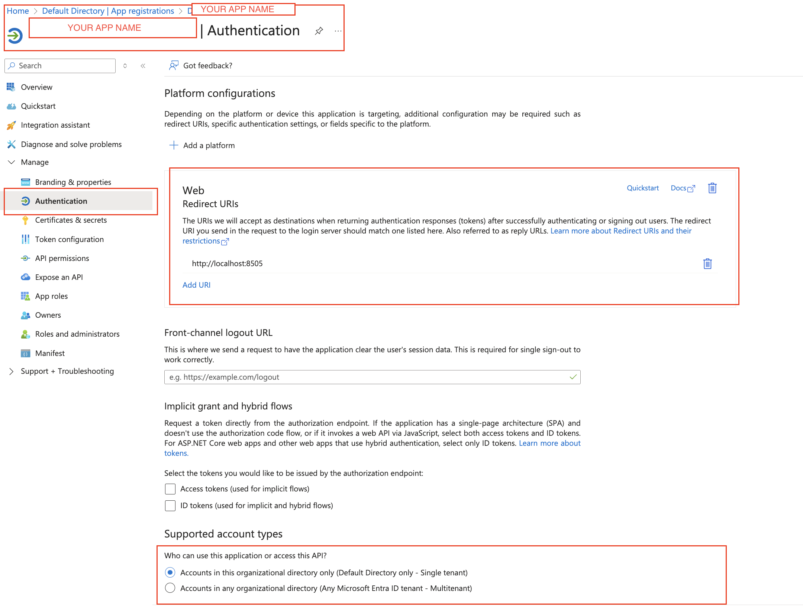
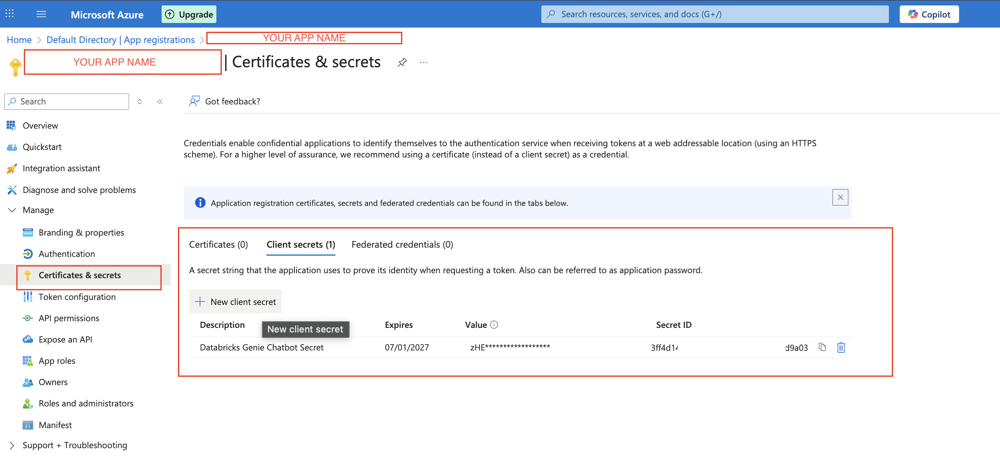
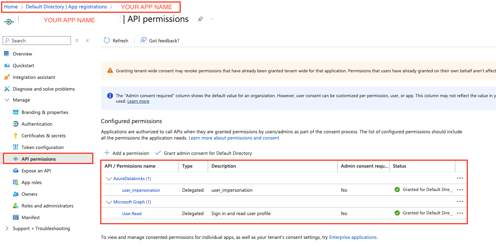
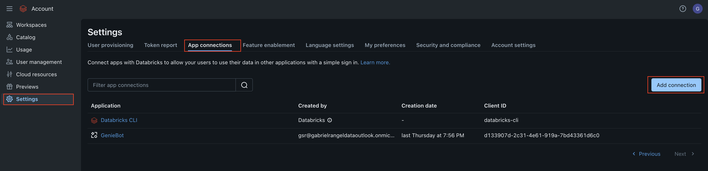
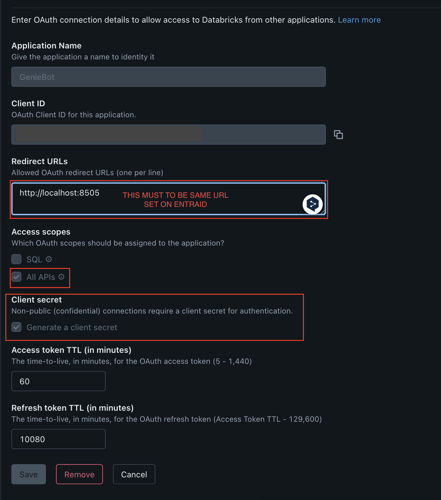

# 🤖 Databricks Genie Chatbot with Microsoft SSO

A streamlit-based chatbot that integrates with Databricks Genie API using dual OAuth authentication flow with Microsoft Entra ID and Databricks OAuth.

## ✨ Demo


## 🚀 Features

- 🔐 **Dual OAuth Authentication** - Secure Microsoft Entra ID + Databricks OAuth flow
- 🤖 **Databricks Genie Integration** - Direct connection to Databricks Genie API for natural language data queries
- 💬 **Interactive Chat Interface** - Clean, modern chat UI with real-time responses
- 📊 **Smart Query Visualization** - Automatically formatted tables and charts for query results
- 📝 **Session Management** - Persistent conversation history with secure token handling
- 🔄 **Asynchronous Processing** - Non-blocking query execution for better user experience
- 🛡️ **Enterprise Security** - MSAL-based authentication following Microsoft best practices

## 🏗️ Architecture Overview

```
┌─────────────────┐    ┌──────────────────┐    ┌─────────────────┐
│   Web Browser   │    │   Streamlit App  │    │ Microsoft Entra │
│                 │    │    (app.py)      │    │       ID        │
└─────────┬───────┘    └─────────┬────────┘    └─────────┬───────┘
          │                      │                       │
          │ 1. Access App        │ 2. Redirect to Login  │
          ├─────────────────────►│──────────────────────►│
          │                      │                       │
          │ 3. Auth Code         │ 4. Exchange for Token │
          │◄─────────────────────┤◄──────────────────────┤
          │                      │                       │
          │                      ▼                       │
          │              ┌──────────────────┐            │
          │              │ Databricks OAuth │            │
          │              │    Redirect      │            │
          │              └─────────┬────────┘            │
          │                        │                     │
          │ 5. Databricks Token    │ 6. API Access       │
          │◄───────────────────────┤                     │
          │                        ▼                     │
          │                ┌──────────────────┐          │
          │                │ Databricks Genie │          │
          │                │      API         │          │
          │                └──────────────────┘          │
```

## 🔐 Authentication Flow

Our application implements a secure dual OAuth flow following Microsoft's MSAL best practices:

### Phase 1: Microsoft Entra ID Authentication
```
User Browser ──► Streamlit App ──► Microsoft Entra ID
     │                │                    │
     │                │ ◄── Auth URL ──────┘
     │ ◄── Redirect ──┘
     │
     ▼
Microsoft Login Page
     │
     │ (User enters credentials)
     │
     ▼
Streamlit App ◄── Authorization Code ── Microsoft Entra ID
     │
     │ (Exchange code for access token)
     │
     ▼
Microsoft Graph API ──► User Profile Data
```

### Phase 2: Databricks OAuth Authentication
```
Streamlit App ──► Databricks OAuth Endpoint
     │                         │
     │ ◄── Auth URL ───────────┘
     │
     ▼
User Browser ──► Databricks Login
     │                   │
     │ ◄── Auth Code ────┘
     │
     ▼
Streamlit App ──► Exchange Code for Token ──► Databricks API
     │                                              │
     │ ◄── Access Token ────────────────────────────┘
     │
     ▼
Genie API Access
```

### Security Features
- **MSAL Integration**: Uses Microsoft Authentication Library following official guidelines
- **Token Persistence**: Secure session-based token storage with automatic cleanup
- **Scope Management**: Minimal required permissions (Microsoft Graph User.Read, Databricks all-apis)
- **State Validation**: CSRF protection through state parameter validation
- **Automatic Refresh**: Transparent token refresh handling

## 📁 Project Structure

```
genie-bot-oauth/
├── 📄 app.py                    # Main application entry point
├── 🔐 auth.py                   # Authentication module (MSAL + OAuth)
├── ⚙️  requirements.txt         # Python dependencies
├── 🔧 .env                      # Environment configuration
└──  📚 README.md                # Project documentation
```

### Core Components

#### `app.py` - Main Application
```python
# Primary responsibilities:
├── Streamlit UI rendering and chat interface
├── Databricks SDK client initialization 
├── Genie API integration and query processing
├── Asynchronous query execution and result formatting
├── Session state management and conversation persistence
└── User authentication state validation
```

#### `auth.py` - Authentication Manager
```python
# AuthenticationManager class responsibilities:
├── Microsoft Entra ID OAuth flow (MSAL-based)
├── Databricks OAuth token exchange
├── Token persistence and session management
├── User profile retrieval from Microsoft Graph
├── Secure logout and token cleanup
└── Authentication state validation across requests
```

#### Key Dependencies
- **`streamlit`** (≥1.28.0): Web application framework with modern chat UI
- **`databricks-sdk`** (≥0.12.0): Official Databricks SDK for Genie API access
- **`msal`** (≥1.25.0): Microsoft Authentication Library for secure OAuth flows
- **`requests`** (≥2.31.0): HTTP client for API communications
- **`python-dotenv`** (≥1.0.0): Environment variable management

## 🛠️ Setup

### Prerequisites

- **Microsoft Azure Account**: With permissions to create app registrations
- **Databricks Workspace**: With admin access to configure OAuth applications  
- **Python 3.10+**: Recommended for optimal compatibility
- **Network Access**: Ability to receive OAuth redirects on localhost

### 1. Microsoft Entra ID Configuration

#### Create App Registration
1. Navigate to [Azure Portal](https://portal.azure.com) → **Microsoft Entra ID** → **App registrations**
2. Click **"New registration"**
3. Configure the application:
   ```
   Name: "YOUR APP NAME"
   Supported account types: "Accounts in this organizational directory only"
   Redirect URI: Web - http://localhost:8505 ⚠️ This is a EXAMPLE, you can provide your own URI, important to specify port if testing locally
   ```
4. After creation, record these values:
   - **Application (client) ID** → `AZURE_CLIENT_ID`
   - **Directory (tenant) ID** → `AZURE_TENANT_ID`
   

#### Create Client Secret
1. Go to **"Certificates & secrets"** → **"Client secrets"**
2. Click **"New client secret"**
3. Set description: "Genie Chatbot Secret"
5. Record the **Value** → `AZURE_CLIENT_SECRET` ⚠️ *Copy immediately - it won't be shown again*


#### Configure API Permissions
1. Go to **"API permissions"** → **"Add a permission"**
2. Select **Microsoft APIs** → **"Microsoft Graph"** → **"Delegated permissions"**
3. Add: `User.Read` (to read user profile)
4. Then, **"API permissions"** → **"Add a permission"** 
5. Select **APIs my organization uses** → **"AzureDatabricks"** → **"Delegated permissions"**
6. Add: `user_impersonation`
4. Click **"Grant admin consent"** (if you have admin privileges)


### 2. Databricks OAuth Configuration

#### Create OAuth Application
1. You must be a **Databricks ADMIN** and be able to access [Manage Console](https://accounts.azuredatabricks.net)
2. In your Databrick Manage Console: **Settings** → **Developer** → **OAuth apps**
2. Click **"Create OAuth app"**
3. Configure:
   ```
   Application name: "YOUR APP NAME"
   Redirect URLs: http://localhost:8505 ⚠️ This is a EXAMPLE, you can provide your own URI, important to specify port if testing locally
   Scopes: all-apis (required for Genie API access)
   ```
4. Record these values:
   - **Client ID** → `DATABRICKS_OAUTH_CLIENT_ID`
   - **Client Secret** → `DATABRICKS_OAUTH_CLIENT_SECRET`

   
   

#### Find Your Genie Space ID
1. Navigate to your **Genie space** in Databricks
2. The space ID is in the URL: `/sql/genie/spaces/{SPACE_ID}`
3. Record this value → `GENIE_SPACE_ID`

### 3. Project Installation

#### Automated Setup (Recommended)
```bash
# Clone repository
git clone <your-repo-url>
cd genie-bot-oauth

#### Manual Setup
```bash
# Create and activate virtual environment
python3 -m venv .venv
source .venv/bin/activate  # On Windows: .venv\Scripts\activate

# Install dependencies
pip install -r requirements.txt
```

### 4. Environment Configuration

Create a `.env` file in the project root with your configuration:

```bash
# Microsoft Entra ID Configuration
AZURE_TENANT_ID=your-tenant-id-here
AZURE_CLIENT_ID=your-client-id-here  
AZURE_CLIENT_SECRET=your-client-secret-here

# Databricks Configuration
DATABRICKS_HOST=https://your-workspace.cloud.databricks.com
DATABRICKS_OAUTH_CLIENT_ID=your-databricks-client-id
DATABRICKS_OAUTH_CLIENT_SECRET=your-databricks-client-secret

# Genie Configuration
GENIE_SPACE_ID=your-genie-space-id

# Application Configuration
REDIRECT_URI=http://localhost:8505 # ⚠️ This is a EXAMPLE, you can provide your own URI, important to specify port if testing locally
```

### Start the Chatbot
```bash
# Ensure virtual environment is active
source .venv/bin/activate

# Start app with custom port
streamlit run app.py --server.port 8505
```

### First-Time Usage
1. **Access Application**: Open browser to displayed URL (typically `http://localhost:8505`)
2. **Microsoft Authentication**: Click "Sign in with Microsoft" → Enter credentials
3. **Databricks Authorization**: Automatically redirected → Authorize workspace access
4. **Start Chatting**: Begin asking questions about your data in natural language

## 📚 API Reference

### Authentication Manager Methods

```python
class AuthenticationManager:
    def is_authenticated(self) -> bool:
        """Check if user has valid Microsoft + Databricks tokens"""
        
    def get_microsoft_auth_url(self) -> str:
        """Generate Microsoft OAuth authorization URL"""
        
    def handle_microsoft_callback(self, auth_code: str) -> Optional[Dict]:
        """Process Microsoft OAuth callback and retrieve user info"""
        
    def get_databricks_auth_url(self) -> str:
        """Generate Databricks OAuth authorization URL"""
        
    def handle_databricks_callback(self, auth_code: str) -> Optional[str]:
        """Process Databricks OAuth callback and retrieve access token"""
        
    def logout(self):
        """Clear all authentication tokens and session data"""
```

### Genie Integration Functions

```python
async def ask_genie(question: str, space_id: str, conversation_id: Optional[str] = None) -> tuple[str, str]:
    """Send natural language query to Genie API and return formatted response"""

def process_query_results(answer_json: Dict) -> str:
    """Format Genie API response into user-friendly markdown"""

def get_databricks_client() -> WorkspaceClient:
    """Create authenticated Databricks SDK client using OAuth token"""
```

## 📖 References

- [Microsoft Authentication Library (MSAL) for Python](https://learn.microsoft.com/en-us/entra/msal/python/)
- [Microsoft Entra ID OAuth 2.0 Documentation](https://learn.microsoft.com/en-us/entra/identity-platform/v2-oauth2-auth-code-flow)
- [Databricks SDK for Python](https://docs.databricks.com/dev-tools/sdk-python.html)
- [Streamlit Documentation](https://docs.streamlit.io/)
- [Databricks Genie API Documentation](https://docs.databricks.com/en/genie/index.html)


